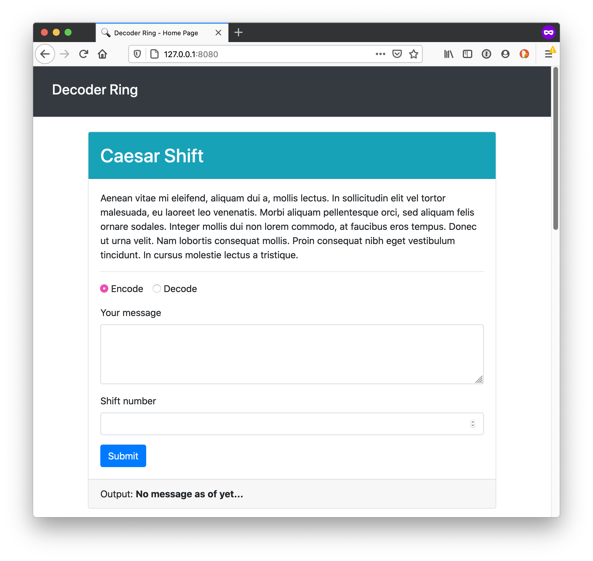
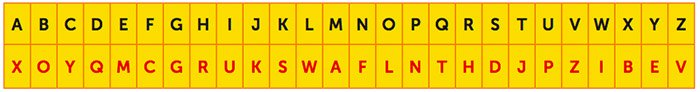

# Project: Decoder Ring

In this hypothetical scenario, a surprise birthday party is being planned for a friend who enjoys escape rooms and puzzles.



This project was designed to test my ability to build complex algorithms as well as write unit tests with Mocha & Chai to test algorithms.

## Learning Objectives

This project assessed the following key learning objectives:

- Write a series of unit tests using Mocha & Chai.
- Use different `expect()` methods to test your code.

## Project Instructions

Build functions for an application that will either encode or decode a string using a variety of ciphers. For each cipher, make a series of tests using Mocha & Chai to confirm that your cipher works.

Below is a list of the project requirements:

-  Complete the `caesar()` function.
-  Write tests for the `caesar()` function.
-  Complete the `polybius()` function.
-  Write tests for the `polybius()` function.
-  Complete the `substitution()` function.
-  Write tests for the `substitution()` function.

### Caesar Shift

The Caesar Shift is a type of substitution cipher originally used by Julius Caesar to protect messages of military significance. It relies on taking the alphabet and "shifting" letters to the right or left, based on the typical alphabetic order.

For example, if you were to "shift" the alphabet to the right by 3, the letter "A" would become "D".

```
"thinkful" -> "wklqnixo"
```

### Polybius Square

|       | **1** | **2** | **3** | **4** | **5** |
| ----- | ----- | ----- | ----- | ----- | ----- |
| **1** | A     | B     | C     | D     | E     |
| **2** | F     | G     | H     | I/J   | K     |
| **3** | L     | M     | N     | O     | P     |
| **4** | Q     | R     | S     | T     | U     |
| **5** | V     | W     | X     | Y     | Z     |

The Polybius Square is a cipher that is achieved by arranging a typical alphabet into a grid. Each letter is represented through a coordinate. Typically, it is possible to arrange the letters however you like and read off the coordinates in whatever direction you like.

In this example, the grid will be arranged as above and coordinates will be read by comparing the first digit to the number on the top of the table and the second digit to that on the left. For example, in the above table, the letter "B" would be represented by the numerical pair "21".

```
"thinkful" -> "4432423352125413"
```

When decoding the message, each pair of numbers is translated using the coordinates.

### Substitution Cipher



The Substitution Cipher requires a standard alphabet and a substitution alphabet. Letters from the standard alphabet will be transposed to the standard alphabet. This cipher requires that the recipient have the substitution alphabet; otherwise, it will be difficult for them to decode the message.

For example, in the image above, the word "HELLO" would be translated as follows:

- "H" becomes "R".
- "E" becomes "M".
- "L" becomes "W".
- "O" becomes "L".

This would result in the code "RMWWL". To decrypt this code, you would simply take the result and transpose back from the substitution alphabet to the standard alphabet.

